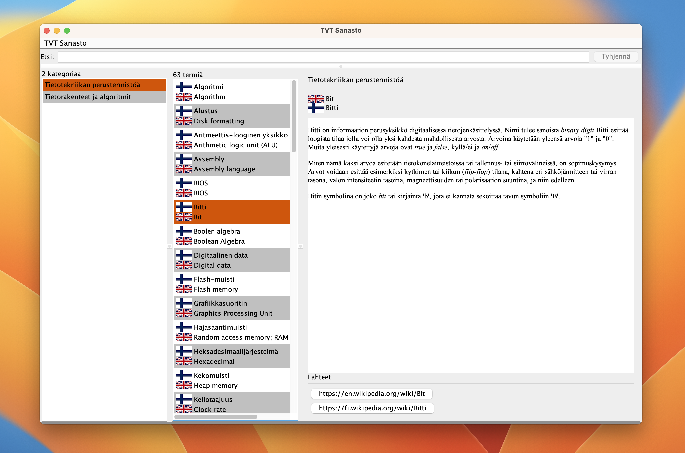

# TVT Sanasto

The **TVT Sanasto** Java/Swing app aims to help in learning the basic terms in the area of Information and Communication Technologies (ICT) in Finnish and English. TVT means Tieto- ja viestintäteknologiat (ICT).



The terms are arranged in categories. For example, terms in the category of "Basic computing" list terms such as *bit*, *byte*, *CPU*, etc. For each term, there are link(s) to further information about the term. Another category on "Data structures and algorithms" could describe terms like *linked lists*, *graphs*, and *heap sort*, for example.

The app fetches an index of term categories from a server. This index file is in JSON format. The list of categories in this index file contain links to the terms for each category, a file in JSON format.

App fetches each of the categories and terms listed in the index file, parses the JSON files and stores the categories and terms in the user's computer in a SQLite database. The terms can then be studied without network connection or consuming the network bandwidth. User can later fetch updates (if any) both to the index and the categories of terms by using the menus in the app.

User may also sort the terms by language and search the terms using keywords. App then lists only those terms containing the keyword.

## Dependencies

The app uses the following Java version 18 features and components:

* Java SE JDK version 18 or newer from https://openjdk.org/install/ 
* Maven for project configuration from https://maven.apache.org/install.html 
* AWT and Swing for the user interface (included in the Java JDK),
* org.json for parsing JSON content (installed by Maven automatically),
* SQLite runtime. If not already installed, get it from https://www.sqlite.org,
* org.xerial JDBC driver for SQLite (installed by Maven automatically),
* Apache log4j for logging (latest version with fixes to the recent vulnerabilities found, installed by Maven automatically),
* com.github.rjeschke txtmark for converting markdown text formatting to HTML in Swing JEditorPane (installed by Maven automatically).

Project is managed using Maven, so the dependencies that are configured in the `pom.xml` that are automatically installed and compiled into the app. Your Java development IDE should be able to use the Maven `pom.xml` to open the project. 

If using Visual Studio Code, for example, install the Java development extensions and Maven extension and then open the project root folder in VS Code.


You can find a rough class diagram of the app in `structure.png` file.

## Building and running

After making sure all the dependent tools are installed, build the app from the command line in the project root directory:

```console
mvn package
```
and then run it:

```console
java -jar target/sanasto-1.0-SNAPSHOT-jar-with-dependencies.jar
```

Obviously you can also run the app from your IDE.

The first time the app is executed, it will download the index and term JSON files and saves the categories and terms in the local database it creates. This may take some seconds, depending on the speed of your PC. Later, the app launches much quicker since it only needs to read the categories and terms from the local database.

## Terms and categories

As mentioned, terms and categories are server hosted JSON files. If you are interested in contributing to the existing terms JSON files or creating new ones, please contact me.

If you wish to support other languages than Finnish/English, please do fork the project and modify it to your needs and create the necessary JSON files for your preferred languages.

## License

MIT License, (c) Antti Juustila, 2022.

See the `LICENSE` file included.

The copyright notice and this permission notice shall be included in all
copies or substantial portions of the Software.

Dependent components are copyright of the respective license holders.
For details, see component documentation.